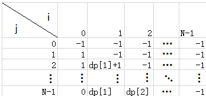

# 题解
----
## 建模
* 图论
	* 以下标索引index为结点，以每个下标可达的next下标为边建立无向图
	* 采用邻接表结构，结点i的边有nums[i]跳，且为连续单位递增序列，最小值为i+1
	* 结点数|V|=N
	* 边数|E|=sum{nums[i], i=1,2...N}
* 背包问题  
	 
*	dp[i][j]=从当前点i开始到达j所需要的跳数+从0跳到i的最小跳数
*	注意：j>i
##
---
## 算法
* DFS+剪枝
	* 时间复杂度远超O(V+E)，因为相当于最短路径算法
* Dijkstra+堆优化+提前退出
	* 时间复杂度为：O(NlogN+E)
	* 由于|E|远超结点数N，因此会导致超时
	* 因此加入限制，在每次对结点i进行边遍历时，当子结点j>N时直接退出
	* 因此边遍历总次数最大为N^2/2
	* 最终时间复杂度为O(NlogN+N^2)=O(N^2)
* DP算法
	* 基于01背包问题方案，推导出递推公式：
		* dp[i][j]=dp[i-1][i]+1, if j<=i+nums[i] and dp[i-1][i]+1<dp[i-1][j]
		* dp[i][j] = dp[i-1][j], others
	* 由于j>i，因此在每一列计算中是相互独立的，因此空间复杂度可以将为O(N)
	* 新的递推公式：
		* dp[j] = dp[i]+1, if j<i+nums[i] and dp[i]<+1<dp[j]
		* dp[j] = dp[j], others
	* 时间复杂度为O(N^2)
* 改进的DP算法（贪心策略）
	* 根据观察：发现结点只会往前跳而不会向后跳，因为如果能到达当前结点i，那么i之前的结点必定也在之前某个结点的跳跃范围内。因此这条性质满足最优子结构。
	* 根据上条性质，如果把dp[i]作为从0跳到i的最小跳数，那么dp必定是个递增序列
	* 我们再保持一个前跳点j，把它作为跳到当前点i的父结点，此前跳点也要根这dp一起更新
		* 在此前跳点范围内的所有结点都是从该前跳点出发的
		* 若每次选择的前跳点都能向后覆盖最大的点，那么直至最后一个结点的跳数是最小的！！！
		* 因此，此前跳点应该为到i为止覆盖范围最远（j+nums[j]最大）的那个点
	* 令dp[i]表示从0跳到i的最小跳数
	* 令prev[i]表示前跳点序列
	* range表示前跳点prev[i]的覆盖范围
	* 递推公式（当前i）：
		* let pre = prev[i], if i <= range; pre = prev[i-1], others
		* dp[i] = dp[pre] + 1
		* prev[i] = i, if i + nums[i] > nums[pre] + pre
		* prev[i] = prev[i-1]
	* 时间复杂度：O(N)
	* 空间复杂度：O(N)
* BFS算法
	* 依据图论，可以将该问题建模为无向图。由于每条边的cost为单位1，因此dijkstra可退化为BFS算法
	* 时间复杂度为：O(N+N^2)=O(N^2)
* 改进的BFS算法
	* 根据之前贪心发现的性质，从0到i的最小跳数序列dp[i]是递增的。在BFS或是dijkstra算法中，每个结点i是依照最小跳数依次入队或出队的，因此每个结点i是按其自身i自然序大小入队或出队的
	* 在BFS或dijkstra算法中，每个结点只入队或出队一次
	* 根据以上分析，只要维护一个值——以入队的最大结点maxIndex。每次探索邻接表（连续单位递增序列）时，直接从maxIndex开始
	* 同样加上边遍历限制，即在每次对结点i进行边遍历时，当子结点j>N时直接退出
	* 最后每个结点遍历一次，因此共进行N次循环
	* 时间复杂度为：O(N)
##
## 有效算法
* 因为本题要求的时间复杂度为O(N)，因此只有以下算法能AC：
	* 改进的DP算法（贪心策略）
	* 改进的BFS算法
